Appendix
========

This chapter contains content to various topics which extend the descriptions in the administration guide.

.. _appendix-add-mongodb-user:

How to add the Effektif MongoDB user with Robomongo
---------------------------------------------------

This section will show an alternative approach on how to create the Effektif database user in MongoDB instead of using the command line. For this approach we will use the free GUI application Robomongo to adminstrate MongoDB. See section :ref:`tooling-mongodb` for more information on Robomongo and where to download it.

*Important: This methods works only if you execute Robomongo on the same system where your MongoDB server is already running. When authentication is turned on, MongoDB will only accept connections from localhost to create the initial user.*

Make sure your MongoDB server is running and open Robomongo.

.. figure:: _static/dbuser/robo01.png
    :align: center
    :scale: 70%

    In the upper left corner click on the icon to open a new connection.

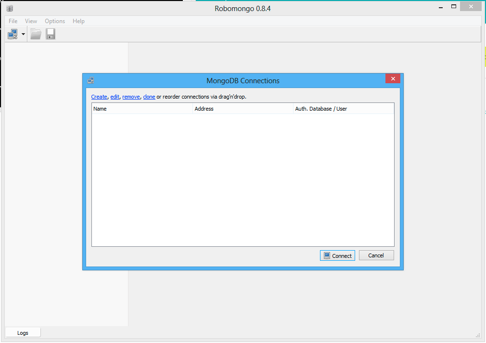
    
    Click on the link *Create* to setup a new connection.

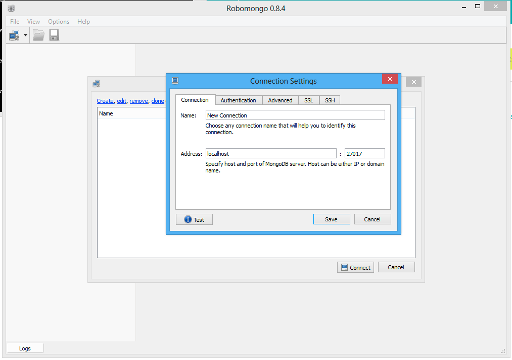

    In the dialog that opens up you can rename the connection. Do not change the address and leave ``localhost`` there. The method explained in this guide will only work when you execute Robomongo on the same server that runs the MongoDB.

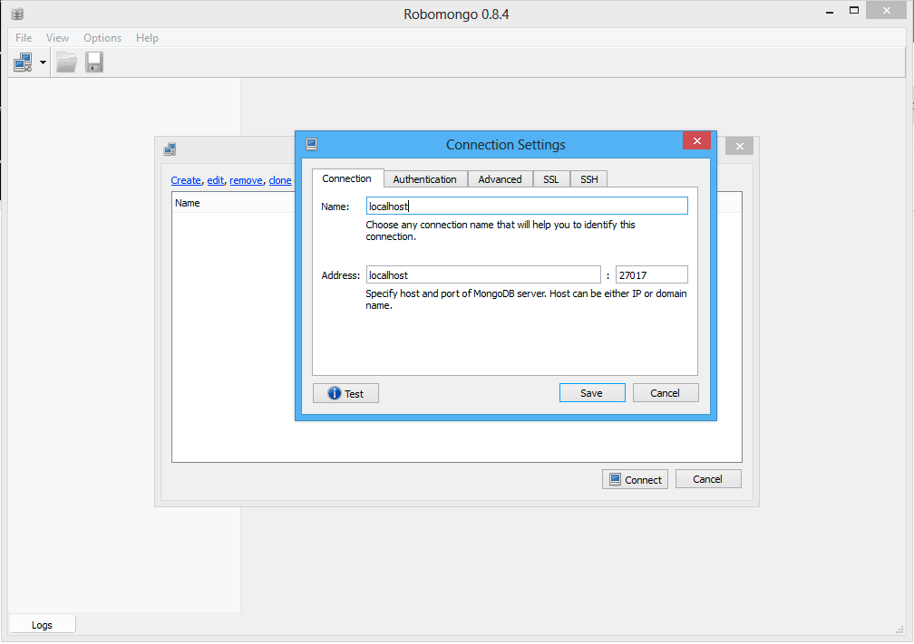

    Click on *Save* to create the new connection.

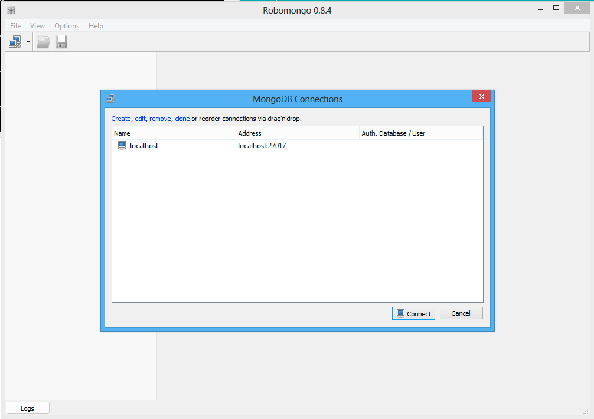

    Select the new item in the list and click on *Connect*\ .

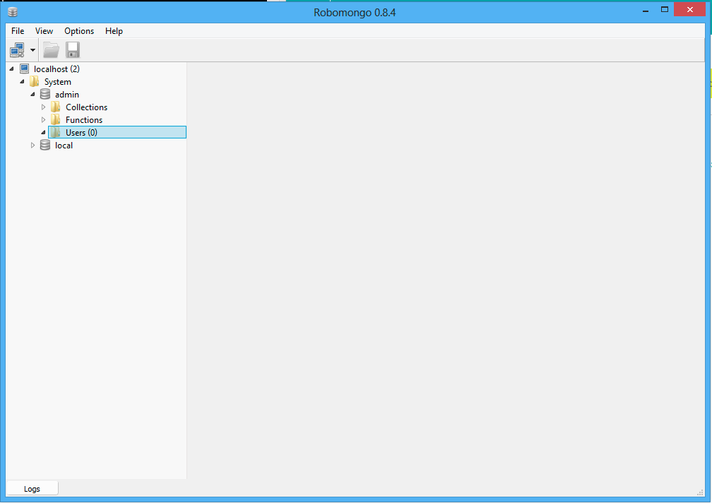

    You will see the connection in the left panel. Open the folder *System* > *admin* and select the folder *Users*\ .

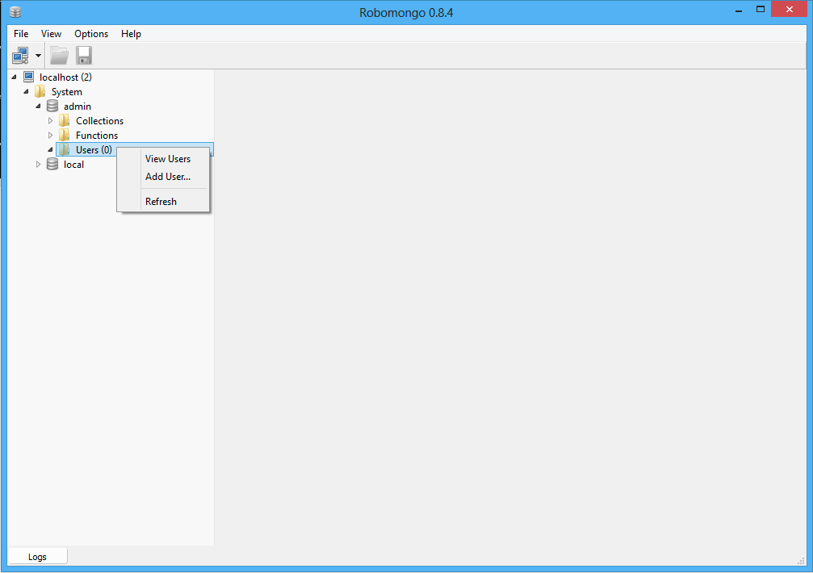

    Right click on the folder *Users* and select the menu entry *Add Users…*\ .

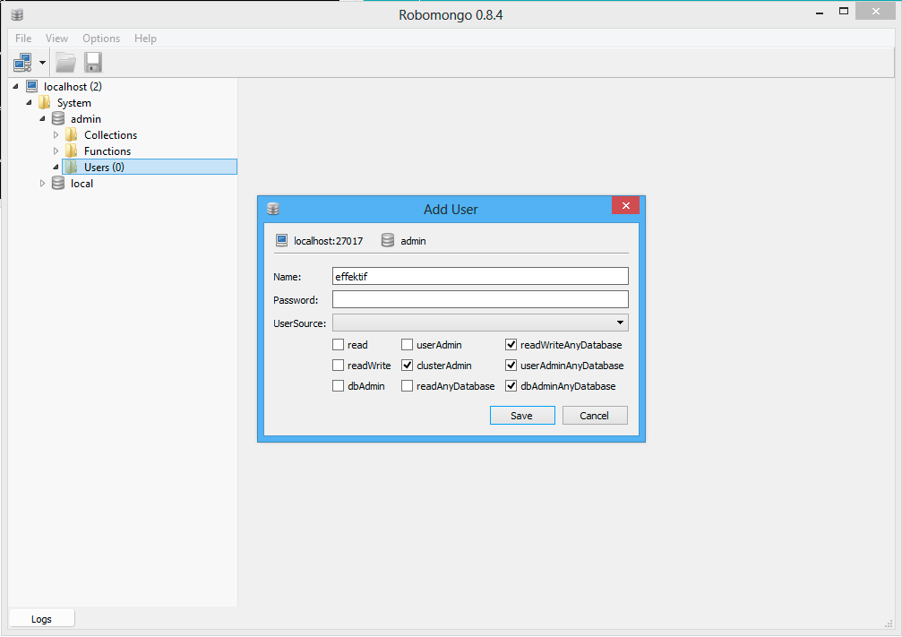

    In the dialog enter the *Name* ``effektif`` and choose a password. Remember this password, you will have to fill it into the Effektif configuration file. Furthermore, select the four roles ``clusterAdmin``\ , ``readWriteAnyDatabase``\ , ``userAdminAnyDatabas``\ , and ``dbAdminAnyDatabase``\ . Eventually, click on *Save*\ . Your Effektif user has been created. 

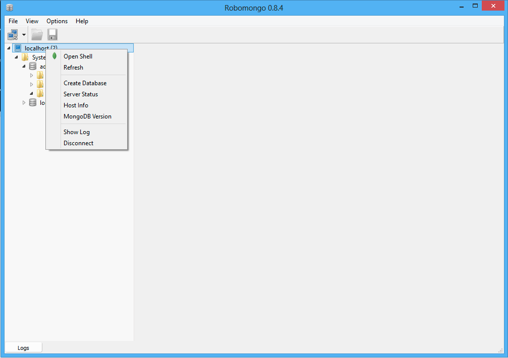

    Because you created a new user, the connection to the MongoDB server now requires a user name and a password. Right click on the connection (in this case *localhost*) in the left panel and select the menu entry *Disconnect*\ . Afterwards, click on the icon for a new connection.

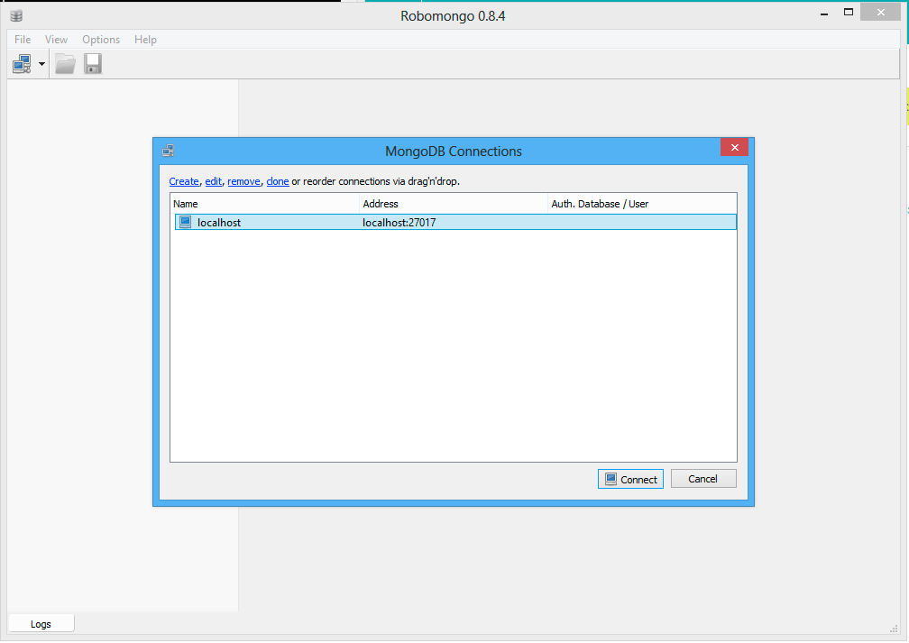

    Select the connection you have created before and click on *edit*\ .

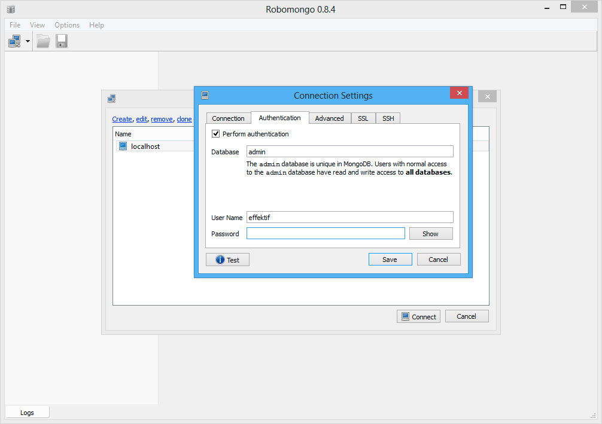

    Go to the tab *Authentication* and activate the option *Perform authentication*\ . Then enter *User Name* (``effektif``) and the *Password* you have chosen before. Finally, click on *Save*\ .

.. figure:: _static/dbuser/robo13.png
    :align: center
    :scale: 70%

    The connection indicates now that it is using the configured user credentials. If you click on *Connect* now, your connection should work again.

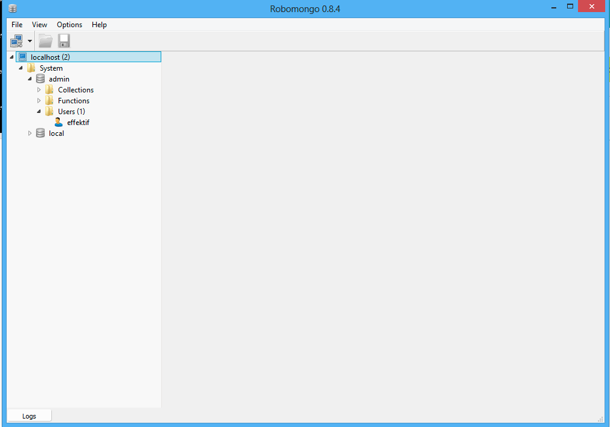

    When you open the folders *System* > *admin* > *Users*\ , you will see the Effektif user, you have created before. If you select the user, do a right click and select the menu entry *Edit User*\ , you can verify the user was created with the four required roles.