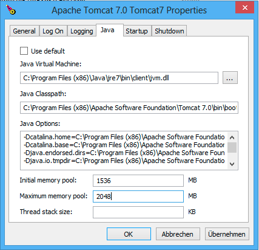

Installation
============
This section will guide you through the setup of Effektif. Simply follow the subsections step by step.

System requirements
-------------------

Operating system
````````````````
The Effektif system can be deployed on different operating systems. Officially supported are the following operating systems:

* Debian Stable Release 64Bit
* Microsoft Windows Server 64Bit

*Important: In general, it is possible to install Effektif on other Linux distributions. However, the installation process can differ from the following instructions.*

You are advised to use a 64Bit operating system in order to be able to assign more than 1.5GB of heap space to the Java VM. Furthermore, MongoDB is limited to 2GB of content on 32Bit operating systems.

Hardware requirements
`````````````````````
The described installation in this adminstration guide will setup the database and the application server on the same system. However, it is also possible to setup the database and application server on separate systems. For instance, if you have already an infrastructure that provides MongoDB instances for different applications, you can simply reuse your infrastructure and just create another database for Effektif.

The minimal hardware requirements for the combined system of application and database server are:

* 4 GB RAM
* 4 core CPU
* 50 GB disk space

The mentioned amount of RAM will be sufficient to execute the Effektif system. Nevertheless, if you can provide the system with more memory, you are advised to do so. Especially MongoDB will benefit from additional system memory.

The required disk space depends on how you will use Effektif. 50 GB should be sufficient disk space for most scenarios. However, if you plan on using a lot of file uploads in your processes the required disk space depends largely on the number and size of the uploaded files. Be aware, the required disk space does not include the space necessary for backups. If you plan on storing the backups on the same server, you should add more.

Other systems
`````````````
The Effektif system relies on a SMTP mail server to send notifications and invite users. You can simply reuse any existing mail server in your organization that supports access via SMTP. 

Software requirements
`````````````````````
In order to run Effektif on your server, you will need to install some additional software. Depending on your deployment strategy (combined or separate system for application and database), you have to install the following software requirements either on the same server or the respective separate servers. 

The following sections contain detailed instructions on how to install and configure the additional software components.

The application server requires the following additional software:

* Java: Oracle JSE version 7 (1.7.0_67+)
* Apache Tomcat 7

The database server requires the following additional software:

* MongoDB version 2.4.x

*Important: MongoDB version 2.6.x is not yet officially supported by Effektif. Please, make sure to install version 2.4.x.*

.. _supported-browsers:

Web browser
```````````
A current web browser is necessary on every client that shall display the Effektif user interface. The following list shows the supported web browsers and versions:

* Google Chrome 23 or newer
* Mozilla Firefox 10 or newer
* Microsoft Internet Explorer 9 or newer
* Apple Safari 5 or newer

Unpack Effektif
---------------
Unzip the effektif-{version}.zip to a directory of your choice, e.g. ``/yourlocation/effektif-{version}``
In the rest of this guide, we'll refer to the effektif home directory as ``$EFFEKTIF_HOME``\ .
The directory will contain the following files:

* \*.sh - Linux shell scripts 
* db - directory that contains MongoDB configuration files

    * mongodb.conf - configuration file for Linux
    * mongod.cfg - configuration file for Windows

* effektif - directory 

    * ROOT - this directory contains the web application

On Linux systems you need to make the scripts executable with the ``chmod`` command like this: ::

    chmod a+x $EFFEKTIF_HOME/*.sh

.. _install-java:

Install Java
------------
The application server requires a Java runtime environment in order to execute the Java backend of Effektif. Therefore, you have to install Java 7 64Bit on the application server. You can download a respective installation package for your operating system here: 

https://www.java.com/en/download/manual.jsp

Install Tomcat
--------------
The Java backend of the Effektif system is executed using Apache Tomcat 7. Effektif does not support any older or younger versions of Tomcat than version 7. 

You can download the latest installation files for different operating systems from the following site:

http://tomcat.apache.org/download-70.cgi

In general, please make sure the user executing the Tomcat has read / write permissions for the folder ``$TOMCAT_HOME/webapps`` and the containing subfolders.

Windows
```````
If you are using a Windows system, the download site offers a Windows Service Installer (“32-bit/64-bit Windows Service Installer”). This installer will install the Apache Tomcat as a Windows service which can be started, stopped and configured over a graphical user interface. The service installer is the recommended way for Windows users to install the Tomcat server. Please, make sure you execute the installer with administrator privileges.

Furthermore, it is recommended to install the Apache Tomcat into a root folder on ``C:\``\ .

Debian
``````
If you are using Linux, you might consider installing Apache Tomcat using a packet manager. In case of Debian, you can use the Advanced Packaging Tool (APT) and execute the following command: ::

    apt-get install tomcat7

Configure Tomcat
----------------
This section will point the configuration options that are required to run Effektif. However, Tomcat offers more configuration options that can be found in the official documentation:

http://tomcat.apache.org/tomcat-7.0-doc/

Java options
````````````
There are some Java options that need to be configured before starting the Tomcat server. These options are configured using the ``JAVA_OPTS`` environment variable. It should contain the following values:

+---------------------------+-----------------------------------------------------------------+
| ``-Xms1536m``             | minimum RAM, should be at least 1.5GB                           |
+---------------------------+-----------------------------------------------------------------+
| ``-Xmx2048m``             | maximum RAM, should be at least 2GB but more is recommended     |
+---------------------------+-----------------------------------------------------------------+
| ``-Dfile.encoding=UTF-8`` | sets UTF-8 as Apache Tomcats default encoding mechanism         |
+---------------------------+-----------------------------------------------------------------+
| ``-XXPermSize=128m``      | initial permanent generation space in MB                        |
+---------------------------+-----------------------------------------------------------------+
| ``-XXMaxPermSize=256m``   | maximum permanent generation space in MB                        |
+---------------------------+-----------------------------------------------------------------+

In order to allocate sufficient RAM to the Tomcat server you have to set the options Xms and Xmx followed by the number of MB allocated and a literal ‘m’. ``Xms`` defines the initial / minimum amount of RAM that is used and ``Xmx`` the allowed maximum. You are advised to allocate at least 2GB of RAM to the Tomcat. However, it is recommended to use more RAM. For example, if you want to assign 4GB of maximum RAM the option would be ``-Xmx4096m``\ .

The values for the permanent generation space have to be increased as well, these are defined by the values ``-XX:PermSize=128m`` and ``-XX:MaxPermSize=256m``\ .

Windows
```````
If you installed Tomcat using the Windows service installer, you can open the configuration dialog by opening the Windows start menu and selecting ``Program Files\Apache Tomcat\Configure Tomcat``\ .



    The Java tab of the Tomcat configuration dialog

The tab Java offers the possibility to set the options and define the memory pool (minimum and maximum RAM usage). Fill in the values for Xms and Xmx into the fields for memory pool and add the other options to the text area labeled as Java Options.

Debian
``````
One way to define the ``JAVA_OPTS`` under Debian and other Linux distributions is to create the file ``setenv.sh`` in the Tomcat 7 ``/bin/`` directory. This directory contains also other files like the ``catalina.sh``\ , the ``startup.sh`` or the ``shutdown.sh`` und is for instance located in ``/usr/share/tomcat7`` or a similar directory.
Simply create or extend any existing setenv.sh file and add the line for ``the JAVA_OPTS``\ : ::

    export JAVA_OPTS="$JAVA_OPTS -Xms1536m [... add the other options]"

In case you have created a new ``setenv.sh`` file, you have to make sure it is executable using the ``chmod`` command: ::

    chmod a+x setenv.sh

Setup the Tomcat connector
``````````````````````````
By default the Tomcat server will start up using port 8080 and 8005. Port 8080 is used for serving the Effektif web application. Port 8005 is used to shutdown the Tomcat instance. You can change the port in the server.xml which is located in ``$TOMCAT_HOME/conf/server.xml``\ .

*Important: If the server is running on any other port than port 80, your users will have to enter the port in the address line of the web browser, e.g. http://effektif.yourdomain.com:8080/\ .*

Locate the HTTP connector and change the value of port to your preferred port. Furthmore, make sure the connector contains the entry ``URIEnconding=”UTF-8”``\ . For example, the connector could look like this:

::

    <Connector port="80" protocol="HTTP/1.1" 
        connectionTimeout="20000" 
        redirectPort="8443" 
        URIEncoding="UTF-8" />

Copy the Effektif webapp
------------------------
The Effektif webapp which can be found in the directory ``$EFFEKTIF_HOME/effektif/ROOT`` needs to be copied to the Tomcat’s webapps folder. Therefore remove any files and folders that are located in ``$TOMCAT_HOME/webapps`` and copy the ROOT folder to ``$TOMCAT_HOME/webapps/``\ .

The Effektif application needs to run as the ROOT application in the Tomcat. Therefore, running it in parallel with another application that requires to run as the ROOT application in the same Tomcat is currently not possible.

Install MongoDB
---------------
MongoDB is the only database system currently supported by Effektif. In case, you have already an infrastructure that can provide a MongoDB version 2.4.x instance, simply create a new instance for Effektif and skip to the section :ref:`configure-mongodb`. Otherwise go on with the installation instructions.

General information about installing MongoDB on different operating systems can be found on:

http://docs.mongodb.org/v2.4/installation/

In case you are using Linux, you have the possibilities to install MongoDB using either a package manager like apt-get or downloading the binaries directly. It is recommened to use the package manager because it will also setup respective scripts that allow you to start and stop the server easily. However, you have to make sure the correct version is installed. Subsection :ref:`install-mongodb-debian` explains in more details how to setup MongoDB on Debian and might work as an example for other Linux distributions.

Remarks for downloading the binaries
````````````````````````````````````
Effektif does not yet support MongoDB 2.6.x. Therefore, you have to download the latest MongoDB 2.4.x release, which will be listed under previous releases. You can find the respective version for your operating system here: 

http://www.mongodb.org/downloads

Please, make sure to download the 64Bit version of MongoDB. The 32Bit version has a limited size of 2GB for stored content and, therefore, cannot be used in productive systems.

Windows
```````
Windows requires you to download the binaries. Consider the remarks of the last subsection when doing so. If you are using any version older than Windows Server 2008 R2, you have to download the 64Bit legacy release. 

You can find more details about installing MongoDB on Windows in the documentation:

http://docs.mongodb.org/v2.4/tutorial/install-mongodb-on-windows/

When you finished downloading MongoDB follow the next steps:

#. Extract the content of the downloaded archive into ``C:\MongoDB`` or any directory of your choice.

    * The MongoDB directory should contain directly the extracted bin directory.
    * Important: The whole path shouldn’t contain any whitespaces. Otherwise the service configuration will not work.

#. Create a data directory for the MongoDB files, e.g. ``C:\MongoDB\data``\ . 

    * This directory will need the most disk space. Make sure the drive has sufficient disk space.

#. Create a logs directory for the MongoDB log files, e.g. ``C:\MongoDB\logs``\ .
#. Copy the file ``$EFFEKTIF_HOME\db\mongod.cfg`` to your MongoDB directory ``C:\MongoDB\mongod.cfg`` and edit the file.

    * The dbpath needs to contain the absolute path to the data directory, e.g. ``C:\MongoDB\data``\ .
    * The logpath needs to contain the absolute path to the log file, e.g. ``C:\MongoDB\logs\mongodb.log``\ . The log file will be created once MongoDB is started.
    * See section :ref:`configure-mongodb` for more information about the other configuration values.

#. Open the command line cmd with administrative privileges and execute the following command. Make sure to use absolute paths and replace them with the matching ones on your system.

    * ``C:\MongoDB\bin\mongod.exe --config C:\MongoDB\mongod.cfg --install``
    * The command line should tell you that the service MongoDB was properly created.
    * You can unregister the service again by executing: ``C:\MongoDB\bin\mongod.exe --remove``
    * The registered service should start MongoDB automatically on startup of Windows.

#. You can now start MongoDB by executing the following command: ``net start MongoDB``
    
    * If this command fails with the error 1053 or 2186, make sure that the configuration file contains absolute paths. Furthermore, the paths must not have any whitespaces and should not be located in any directory that requires admin privileges.
    * You can stop MongoDB by calling: ``net stop MongoDB``
    * The service is also listed in the services window that can be opened by running ``services.msc``\ .

.. _install-mongodb-debian:

Debian
``````
If you are installing MongoDB on a Debian system, you are advised to use the method described in the MongoDB configuration:

http://docs.mongodb.org/v2.4/tutorial/install-mongodb-on-debian/

For convenience reasons the script ``$EFFEKTIF_HOME/mongodb.install.debian.sh`` already wraps all necessary commands to install the correct version of MongoDB using apt-get. Simply execute it from the command line by opening ``$EFFEKTIF_HOME`` and calling: ::

    sudo ./mongodb.install.debian.sh

This will add the MongoDB repositories to your package sources and install the version 2.4.x of MongoDB.
You can now simply start and stop the MongoDB server by calling ::

    sudo /etc/init.d/mongodb start

or ::

    sudo /etc/init.d/mongodb stop

The server will use the default configuration file ``/etc/mongodb.conf``\ . See the next subsection for more information on how to configure MongoDB for Effektif and create the required user. Be aware, the installation probably started the MongoDB server already. You will need to restart the MongoDB server when you edit the configuration.

.. _configure-mongodb:

Configure MongoDB
-----------------
In order to run MongoDB properly, some configuration options have to be defined. The easiest solution is to create a configuration file and link this configuration file when starting MongoDB with the option ``--config``\ .

If you installed MongoDB under Windows using the method in the last section, you have already copied the predefined configuration file and adjusted the values for dbpath and logpath to your system. Then your configuration file contains already all necessary values.

If you installed MongoDB under Linux using apt-get, e.g. by following the instructions in the last section, there should be a respective configuration file ``/etc/mongodb.conf``\ . Edit this configuration file. The properties dbpath and logpath should be defined already. It is recommened to set the properties logpath and auth to true. Furthermore, you will need to add the entry ``setParameter=textSearchEnabled=true``\ . 

In any other case make sure the configuration file contains the following properties.

.. tabularcolumns:: |p{3cm}|p{12cm}|

+-------------------+-----------------------------------------------------------------------------------------------------------------------------------------------------------+
| ``dbpath``        | Defines the directory where the database files are stored.                                                                                                | 
+-------------------+-----------------------------------------------------------------------------------------------------------------------------------------------------------+
| ``logpath``       | Defines the file that will contain the logging output.                                                                                                    |
+-------------------+-----------------------------------------------------------------------------------------------------------------------------------------------------------+
| ``logappend``     | Indicates that new logs will be appended to an existing log file after restarting the server, if set to true.                                             |
+-------------------+-----------------------------------------------------------------------------------------------------------------------------------------------------------+
| ``setParameter``  | set the value to ``textSearchEnabled=true``                                                                                                               |
+-------------------+-----------------------------------------------------------------------------------------------------------------------------------------------------------+
| ``auth``          | (optional) Turns authentication on, if set to true. It is advised to turn authentication on in case the MongoDB instance can be accessed over the network.|
+-------------------+-----------------------------------------------------------------------------------------------------------------------------------------------------------+

For more configuration options, see http://docs.mongodb.org/v2.4/reference/configuration-options/\ .

.. _add-mongodb-user:

Add a database user for Effektif
````````````````````````````````
Effektif requires a MongoDB user in the admin database that has the following roles:

.. tabularcolumns:: |p{5cm}|p{10cm}|

========================    ========================
``dbAdminAnyDatabase``
``readWriteAnyDatabase``
``clusterAdmin``            This role will allow you to list all databases. This becomes necessary if you plan on using the user credentials when editing any database content with a tool like Robomongo. Furthermore, it is necessary for creating backups.
``userAdminAnyDatabase``    This role is required for backups.
========================    ========================

The user will access the databases for Effektif. Effektif will create two databases, one for the user and workflow data, and one for uploaded files. The name of the first database can be configured in the Effektif configuration file. The name of the second database is derived from the name of the first one by adding “-files”. For instance, if you define the database name “effektif”, the databases “effektif” and “effektif-files” will be created.

In general, if you want to create a new user in MongoDB you will need to authenticate with an existing user that has the role userAdmin or userAdminAnyDatabase. There is an exception for a fresh MongoDB setup. It will allow you to create the first user from localhost without any authentication. The following examples will show you how to create a new user using the credentials of an admin user and how to do it without any credentials in case of a new MongoDB.

In order to add a new user to MongoDB, the MongoDB server has to be running.

Windows
```````

#. Open the command cmd and go to your MongoDB\bin directory, e.g. by executing: ``cd C:\MongoDB\bin``
#. If you have an admin user, create the Effektif user by executing: 

    * ``mongo.exe admin -u admin -p <enterYourAdminPasswordHere> --eval "db.addUser( { user: 'effektif', pwd: '<enterEffektifPasswordHere>', roles: ['dbAdminAnyDatabase', 'readWriteAnyDatabase', 'clusterAdmin', 'userAdminAnyDatabase'] } )"``
    * Replace <enterAdminPasswordHere> with the password, you have defined for the admin user.
    * Replace <enterEffektifPasswordHere> with the password for the new Effektif user. As you can see the user name is effektif.

#. If you have a new MongoDB and no admin user, create the Effektif user by executing:
    
    * ``mongo.exe admin --eval "db.addUser( { user: 'effektif', pwd: '<enterEffektifPasswordHere>', roles: ['dbAdminAnyDatabase', 'readWriteAnyDatabase', 'clusterAdmin', 'userAdminAnyDatabase'] } )"``
    * Replace <enterEffektifPasswordHere> with the password for the new Effektif user. As you can see the user name is effektif.

#. You can verify the creation of the new Effektif user by executing:
    
    * ``mongo.exe admin -u effektif -p <enterEffektifPasswordHere> --eval "db.system.users.find({ user: 'effektif'}).forEach(function(u) {printjson(u)});"``
    * On the command line you will see the user information including the four assigned roles.

Debian
``````
If you have installed MongoDB using a package manager, the binaries should be available on the path. Otherwise, open the directory with the MongoDB binary files and  follow the instructions.

#. If you have an admin user, create the Effektif user by executing: 

    * ``mongo admin -u admin -p <enterYourAdminPasswordHere> --eval "db.addUser( { user: 'effektif', pwd: '<enterEffektifPasswordHere>', roles: ['dbAdminAnyDatabase', 'readWriteAnyDatabase', 'clusterAdmin', 'userAdminAnyDatabase'] } )"``
    * Replace <enterAdminPasswordHere> with the password, you have defined for the admin user.
    * Replace <enterEffektifPasswordHere> with the password for the new Effektif user. As you can see the user name is effektif.

#. If you have a new MongoDB and no admin user, create the Effektif user by executing:
    
    * ``mongo admin --eval "db.addUser( { user: 'effektif', pwd: '<enterEffektifPasswordHere>', roles: ['dbAdminAnyDatabase', 'readWriteAnyDatabase', 'clusterAdmin', 'userAdminAnyDatabase'] } )"``
    * Replace <enterEffektifPasswordHere> with the password for the new Effektif user. As you can see the user name is effektif.

#. You can verify the creation of the new Effektif user by executing:
    
    * ``mongo admin -u effektif -p <enterEffektifPasswordHere> --eval "db.system.users.find({ user: 'effektif'}).forEach(function(u) {printjson(u)});"``
    * On the command line you will see the user information including the four assigned roles.

Once the Effektif user is created, its credentials have to be added to the Effektif configuration file to the properties ``effektif.mongodb.username`` and ``effektif.mongodb.password``\ . Section :ref:`update-effektif-configuration` explains how to update the configuration file.

.. _configure-effektif:

Configuring Effektif
--------------------

.. _install-license:

Install the license file
````````````````````````
Along with the Effektif application you have received the Effektif license file license.xml. Before you can start the Effektif system, you have to add the license file to the application. Therefore, copy the license file into the directory ``$TOMCAT_HOME/webapps/ROOT/WEB-INF/classes``\ . The Effektif system will check your license file on startup and setup the defined number of licenses.

.. _update-effektif-configuration:

Update the Effektif configuration file
``````````````````````````````````````
Before you can start Effektif for the first time, you need to configure some mandatory properties in the Effektif configuration file. Make sure you have copied the Effektif web application to the Tomcat’s webapps directory before continuing. The configuration file can be found here ``$TOMCAT_HOME/webapps/ROOT/WEB-INF/classes/effektif-onpremise.properties``\ . 

The configuration file is a property file that contains one configuration option per line and key and value are separated by a “=”. Every line that starts with a “#” is commented out and will not be considered.

In general, the configuration allows to configure the base URL of the Effektif system, the mail server, the database connection and integrations with third party systems (e.g. Signavio).

.. tabularcolumns:: |p{6cm}|p{9cm}|

=============================   =============================
``effektif.baseUrl``            (Required) The ip address or server name (incl. the port) of the server running the Effektif Tomcat application server. E.g. http://effektif.yourdomain.com:8080\ . If the server is running on port 80, the port can be omitted.
``effektif.smtp.host``          (Required) The ip address or server name of the outgoing email server.
``effektif.smtp.port``          The port on which the outgoing SMTP server listens
``effektif.smtp.ssl``           If SSL should be used ( true or false )
``effektif.smtp.tls``           If TLS should be used ( true or false )
``effektif.smtp.user``          The username for authentication
``effektif.smtp.password``      The password for authentication
``effektif.mail.from``          This email address is used as the sender when the Effektif system sends out notifications.
``effektif.mongodb.servers``    A comma separated list of mongodb servers (hostnames). If you have MongodDB running on the same server as Tomcat, the default value of localhost is ok.
``effektif.mongodb.username``   The Effektif MongoDB user name. If you created the user following the instructions in this guide, the name is effektif .
``effektif.mongodb.password``   The password of the Effektif MongoDB user. This is the password you have defined during the user creation.
``effektif.mongodb.database``   The name of the database Effektif should use. The default value effektif is ok.
=============================   =============================

The following properties are only relevant if your Effektif installation is connected to your Signavio installation. ::

    effektif.com.effektif.model.service.signavio.SignavioAuthenticationProvider.
        serviceBaseUrl
    effektif.com.effektif.model.service.signavio.SignavioAuthenticationProvider.
        clientId
    effektif.com.effektif.model.service.signavio.SignavioAuthenticationProvider.
        clientSecret

See section :ref:`signavio-integration` for more information on how to set up the integration.

Configure logging
`````````````````
The Effektif system has its own application log file ``effektif.log``\ . You need to define the directory where this log file is stored. The directory is specified in the file ``$TOMCAT_HOME/webapps/ROOT/WEB-INF/classes/logback.xml``\ . Open the file and update the following line: ::

    <property name="LOG_DIR" value="./log"/>

The value should contain an absolute path. Make sure the user executing Tomcat has the required read / write permissions for the directory. 

On Windows it necessary to escape all "\\". An example value could like this: ``"C:\\Logs\\Effektif"``\ .

This configuration file also enables you to change the log level in this file. By default, the log level is INFO. However, in a scenario where you require official support, you will be asked to set the log level to DEBUG. In order to so, update the following: ::

    <root level="INFO">

Change it to: ::

    <root level="DEBUG">

You will need to restart the Tomcat server for the changes to take effect. You can find more detailed information on how to start the Tomcat server in the next section.

The log file is configured to do a roll over. Every day, a new log file is created which contains a timestamp in the filename similar to ``effektif-2014-10-09.log``\ . The most recent log entries can still be found in the file effektif.log. After 30 days, the log files will be removed automatically. 

