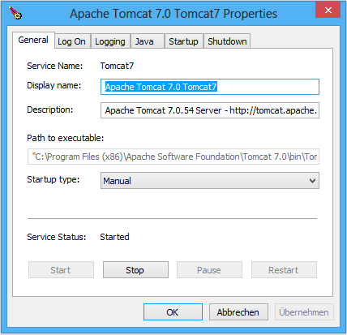
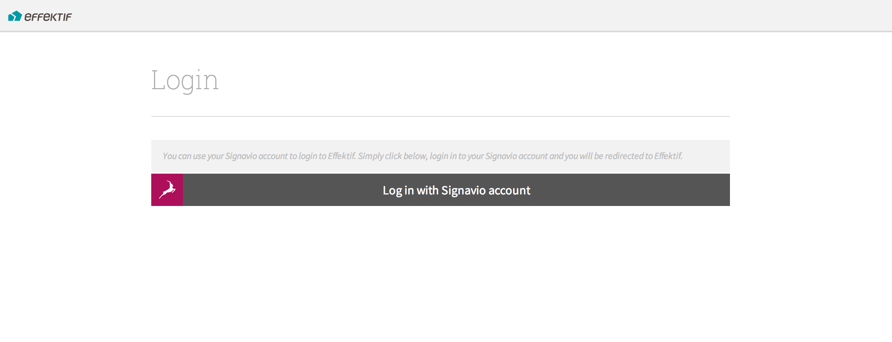

.. _starting-effektif:

Starting Effektif
=================
If you have finished the setup successfully, you can go on and start the Effektif application. You can use the checklist in the next subsection to verify you didn’t forget anything. The following subsection explains how to start Effektif on different operating systems.

Checklist
---------
Before starting Effektif, use the following checklist to make sure everything is setup properly.

* Oracle Java 7 is installed
* Apache Tomcat 7 is installed

    * the Java options are configured

* MongoDB is installed
    
    * MongoDB is configured
    * a MongoDB user for Effektif was created

* the Effektif ROOT folder was copied into the Tomcat webapps directory
* the Effektif license was copied to the correct directory
* the Effektif configuration file was updated

    * the base URL is set
    * the mail configuration is set
    * the database connection is set

* the Effektif log file is configured

If the system is integrated with Signavio check also the following points:

* Effektif is configured in the Signavio configuration.xml
* Signavio is configured in the Effektif configuration file

Start Effektif
--------------
After completing the installation as described above, both the MongoDB database and the Tomcat application server must be started for Effektif to run properly. This section will give you more details on how to start them.

Windows
```````

MongoDB
^^^^^^^
If you followed the instructions in this guide and registered a service for MongoDB, you can simply start the MongoDB server by opening a command line with administrator privileges and execute the following command: ::

    net start MongoDB

The registration also defined the startup type of the MongoDB service as “Automatic” which means it will start automatically if you restart the Windows system.
Alternatively, you can manage the MongoDB service by opening the ``services.msc``\ . There, MongoDB will be listed among the other services and can be started and stopped.

Tomcat
^^^^^^
Assuming you installed Tomcat using the Windows service installer, you can open the Tomcat configuration dialog again by opening the Windows start menu and selecting ``Program Files\Apache Tomcat\Configure Tomcat``\ . The tab General contains respective buttons to start and stop the Tomcat service. 



Furthermore, you have the option to define the startup type of the service. By default, this should be “Manual” which means you have to start the Tomcat server manually each time the server restarts. You can change the type to “Automatic”. Then the Tomcat server will start automatically each time you restart your Windows server.

Debian
``````

MongoDB
^^^^^^^
If you followed the instructions in this guide to setup MongoDB using a packet manager, some additional scripts have been installed that allow you to start, stop and restart the database very easily. Be aware, the execution of those scripts might require root privileges. ::

    /etc/init.d/mongodb start

If MongoDB is already running, you can restart the database by executing: ::
    
    /etc/init.d/mongodb restart

In order to determine whether MongoDB is running or not, you can check upon the status with the following command: ::
    
    /etc/init.d/mongodb status

Tomcat
^^^^^^
The recommended way to install Tomcat is to use a packet manager. Installing Tomcat under Debian with APT will install additional scripts to start, stop and restart the server. Be aware, the execution of those scripts might require root privileges. ::

    /etc/init.d/tomcat7 start

You can restart the Tomcat server if it is already running by executing: ::

    /etc/init.d/tomcat7 restart

Furthermore, you can check upon the status of the Tomcat and determine whether it is running or not with the following command: ::

    /etc/init.d/tomcat7 status

Login to Effektif
-----------------
When the Effektif system was started properly you can see the login screen by entering the URL of your Effektif installation in your browser. There are different versions of the login screen. If you purchased an Effektif standalone version, you will see a form that requires an email address and a password to login.
 
.. figure:: _static/login_en.png
    :align: center

    The default Effektif login screen

If you purchased Effektif along with Signavio, you will see a login screen with one button. You can login to Effektif using your Signavio account as soon as the Effektif users have been set up. Jump to section :ref:`signavio-user-management` for more information on how to set up the users. 



    The Signavio login screen

When you click *Log in with Signavio account*\ , you will be redirected to Signavio and asked to authorize the access of Effektif. When you click on *Grant*\ , you will be redirected back to Effektif and automatically logged in. The authorization dialog is only shown the first time you use this method to login.

.. figure:: _static/authorization_en.png
    :align: center

    The Signavio authorization dialog

Be aware, you have to be logged in to Signavio in order to see the authorization dialog. Otherwise, you will be redirected to the Collaboration Portal. 

Create the initial user
-----------------------
In case you purchased Effektif along with Signavio and want to setup the integration, you don't have to create the initial Effektif user manually. Please jump to section :ref:`signavio-user-management` for more information.

Effektif users are organized in organisations. There is a maximum amount of organisations that can be registered on an on-premise system. You will find the maximum number of available organisations in your license file. When the initial user registers, he will automatically create the first organisation.

In order to register, enter the URL of your Effektif installation in your browser. You will see the login screen of Effektif.

Click *register* in the lower right corner, fill in your email address and click *Register a new user*\ . You will then receive an email with a link to complete your registration. After you have done that, your Effektif organisation is set up and you can go ahead and invite more users.

Every time a user registers using the register link on the login screen, a new organisation is created until the maximum amount is reached. In general, you will create one organisation and invite other users to join this organisation. The next subsection explains how to invite users.

Invite other users
------------------
In case this is an integrated installation with Signavio, please jump to section :ref:`signavio-integration` for setting up synchronization of users.

To invite other users, go to the organization configuration panel. That's located in the dropdown under your name in the top right corner named *My organization*\ . In section Invitations you can enter email addresses of users you want to invite. The amount of users that can be invited to your organisation depends on the number of user licenses you have acquired. All organisations on an on-premise system share the same license pool. This means the shown number of unused licenses is the same in every organisation. If one organisation invites another user the count of unused licenses in all organisations decreases.

A user can be invited to multiple organisations. If a user is part of two organisations, he will require two user licenses, one for each organisation he is part of.